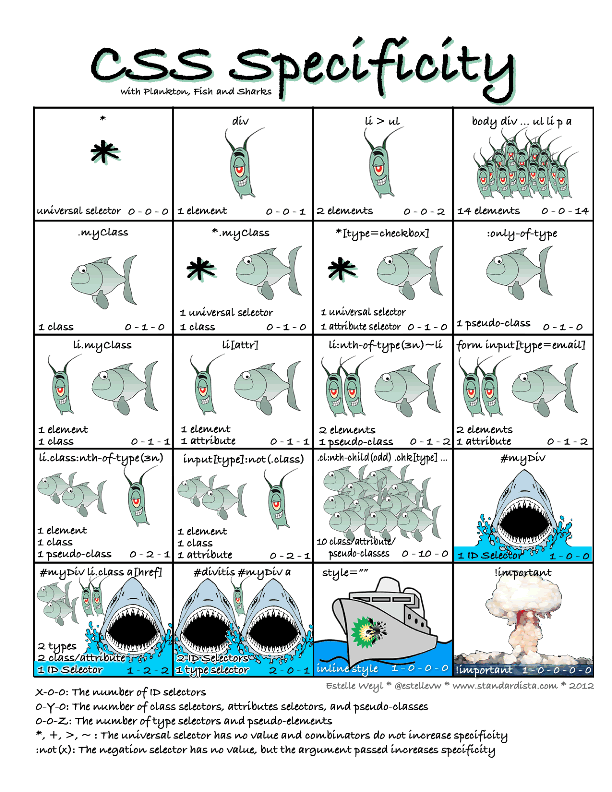
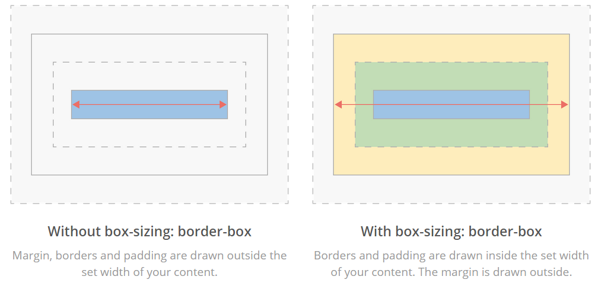

# Basics of HTML and CSS

# HTML

#####Reading:#####
All the basics about the markup language are available at [WebPlatform](http://docs.webplatform.org/wiki/html/tutorials). Please follow the different tutorials and you will be learning from basic tag semantics (span, p, div) to others more specific as (section, article, nav, etc).

Also you can learn and do exercise in [codecademy](http://www.codecademy.com/tracks/web).

#####Practice:#####

1. **The Basics of HTML:** create a basic `.html` file and experiment a little with your browser modifying and reloading to see the changes reflected.
2. **Doctypes and Validations:** Keep focus on validate what you have written (DOCTYPES defines how you should write your content). [Validate your file](http://validator.w3.org/)
3. **The HTML head:** You will see how to link your html file with other assets as `js` and `css`, for now keep focus on markup semantics and make some examples changing your already created file.
4. **The HTML body:** Keep focus on markup semantics and understand default behaviors provided by the different types of inputs (`type=text`, `type=number`, `type=date`, etc). Do not care about browsers compatibility, just use lastest chrome or firefox to experiment.

Once you finish with **The HTML body**, you should have a `html` file with several examples applying the different tags you were playing in the tutorial (do not include any JS o CSS code).

Now we will start with the creation of our web page.

1. Add a basic page structure using HTML as it’s described in the following picture:

2. Inside the header add an image logo. You can use this [placeholder](http://placehold.it/400x100&text=Logo)
3. Inside the nav add 4 links
4. Inside the section add an article.

Notes: You can pick the content from here: http://foundation.zurb.com/templates/feed.html

# CSS

## Rules
  
### Selectors and properties 

#####Reading:#####

* [Brief of CSS selectors](http://www.sitepoint.com/web-foundations/css-selectors/)
* [More Css selectors](http://estelle.github.io/selectors/#slide1)
* [CSS3 selectors sheet](http://www.w3.org/TR/css3-selectors/)
* [Play a little game to consolidate your knowledge](http://flukeout.github.io/)
* [Bookmark the following list of properties for future reference](http://ref.openweb.io/CSS/)
* [Bookmark a reference of CSS Vocabulary](http://pumpula.net/p/apps/css-vocabulary/)

#####Practice:#####

  * Create an empty style.css file and link it to the index.html using [<link> tag](https://developer.mozilla.org/en-US/docs/Web/HTML/Element/link#Examples).
  * Include [normalize.css](http://necolas.github.io/normalize.css/) before your style.css to fix cross-browser problems.
  * Add background to the header, footer, aside and nav.
  * Add a global font definition (at html element) with a value of 14px, using a font-family you like.
  * Make the header and footer text centered.
    
### Specificity

[Learn about CSS Specificity (basically how the rules override others)](http://www.w3.org/TR/CSS21/cascade.html#specificity)

* [Experiment specificity right now using CSS3 selectors](http://specificity.keegan.st/)
* 
#####Practice:#####

* Now add classes to the different HTML tags with the following names:
    * To &lt;header&gt;  add class .header
    * To &lt;footer&gt;  add class .footer
    * To &lt;section&gt;  add class .content
    * To &lt;nav&gt;  add class  .navigation
    * To &lt;aside&gt;  add class  .sidebar
* Using the new added classes figure out how to override:
    * .header must define a font-size: 46px;
    * .footer must define a font-size: 10px;
    * .content must define a font-size: 14px;
    * .navigation must define a font-size: 12px;
    * .sidebar must define a font-size: 10px;
* If the class attribute finish with **r (example header, footer)**, the background must be magenta.
* If the class attribute contain an **a (example nav)** but do NOT finish with r, the background must be blue.
* How could you add weight to the global font definition to override all the overrides provided by point c?
* Imagine you have something like class=”oh-no-inline-styles” style=”background:red” and you should change the background to green but without changing the inline style, How could you accomplish this?

### CSS Units

The `<length>` CSS data type denotes distance measurements.  It is a <number> immediately followed by a length unit (px, em, pc, in, mm, …).

Many CSS properties take <length> values, such as width, margin,  padding, font-size, border-width, text-shadow, and more.

For some properties, using negative lengths is a syntax error, but for some properties, negative lengths are allowed.

#####Reading:#####
* [CSS Concepts Common Units of Measurement - Video] (http://www.dailymotion.com/video/x242ej5_2-0-css-fundamentals-common-css-concepts-common-units-of-measurement_lifestyle)
* [CSS3 rem units - Video](http://www.sitepoint.com/css3-rem-units/)
* [Which CSS Measurements To Use When](http://demosthenes.info/blog/775/Which-CSS-Measurements-To-Use-When)
* [Learning to love the boring bits of CSS] (http://alistapart.com/article/love-the-boring-bits-of-css)

### CSS Layout

[Learn CSS fundamentals that are used in any website's layout] (http://learnlayout.com/)

#### The Box Model

* [Learn about the Box Model (how the browser calculate boxes size)](http://www.w3.org/TR/CSS21/box.html)
  * [Play with it here changing width / margin / padding / box-sizing](http://dabblet.com/gist/2986528)
* [How to alter the box model calculations](http://quirksmode.org/css/user-interface/boxsizing.html)
* [Extra about box-sizing](http://adamschwartz.co/magic-of-css/chapters/1-the-box/)
  * Use the playground provided above to change *box-sizing* and see the changes.

#### Other properties here?

Practice: 
* Using your own layout system, implement the following page (only desktop).
  
  * When the user **:hover** the right side black box (observe at middle right of the screen shot) it must show a “hello world” message and go back when move the mouse out. To accomplish this [Learn about CSS position](http://learnlayout.com/position.html). 

### Responsive Web Design

[A simple guide to responsive web design] (http://www.adamkaplan.me/grid/)

#### Media Queries

[Learn Media Queries](http://css-tricks.com/css-media-queries/) and Adapt the given layout to be ready for mobile screens using the following design as guide [example](http://mediaqueri.es/ity/).

See more:
* [A collection of inspirational websites using media queries and responsive web design] (http://mediaqueri.es/)
* [Media Queries Bookmarklet] (http://seesparkbox.com/foundry/media_query_bookmarklet)

### Preprocessors

Preprocessors compile the CSS code we write in a processed language to the pure CSS syntax we’re all used to. 

* [Introduction to preprocessors](http://cdharrison.com/presentations/awdgcss/#/)
* [Getting started with LESS](http://www.hongkiat.com/blog/less-basic/)
* [LESS](http://lesscss.org/)
